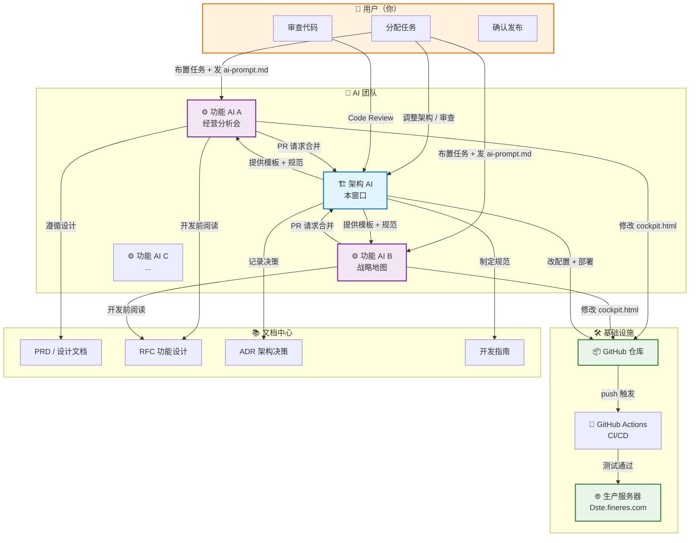
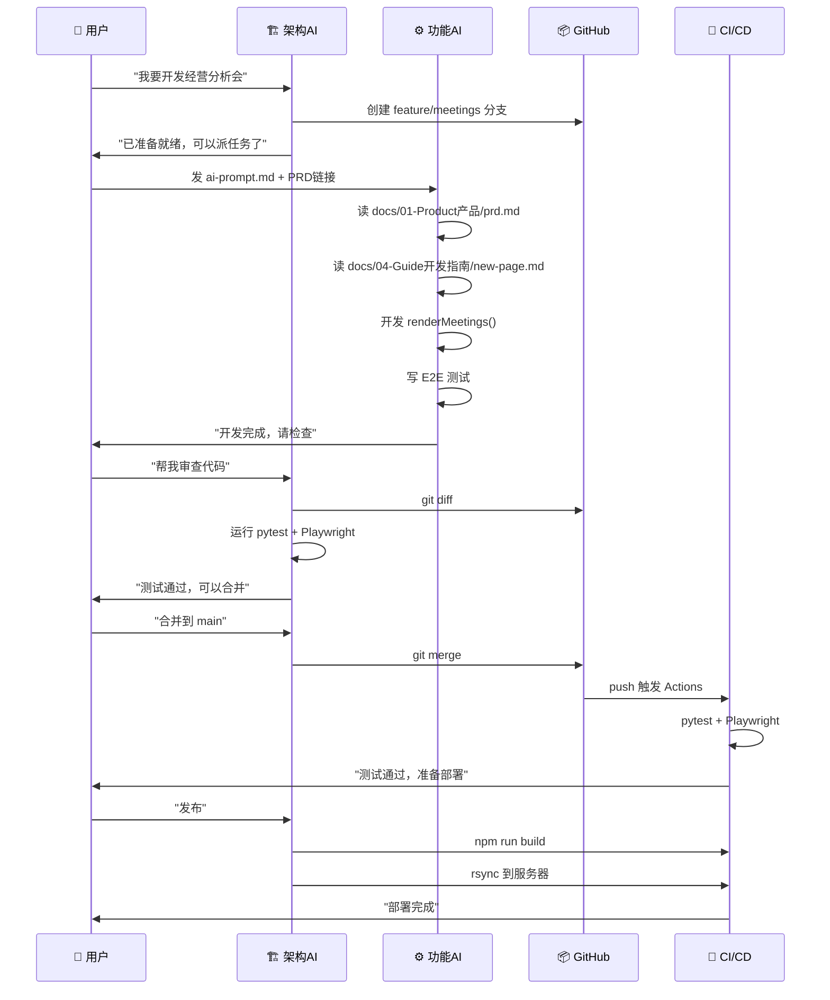
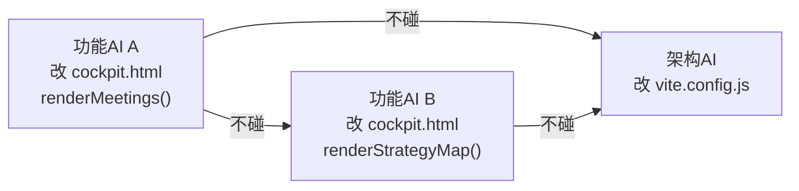

# 多 AI 协作架构图

## 整体架构



## 工作流时序



## 职责边界

| | 🏗️ 架构 AI | ⚙️ 功能 AI |
|--|-----------|-----------|
| **代码范围** | 配置文件、路由、部署脚本、代码审查 | `cockpit.html` 内渲染函数 |
| **文档维护** | `docs/02-RFC/`, `docs/03-ADR/`, `docs/04-Guide/` | `docs/02-RFC/001-xxx.md`（开发前写） |
| **测试** | 确保全部测试通过 | 写自己模块的 E2E 测试 |
| **Git 操作** | merge, tag, release | 不操作 Git |
| **部署** | 一键发布 | 不参与 |

## 防冲突机制



**核心规则**：每个 AI 只改自己的代码区域，公共配置由架构 AI 统一管理。

## 文件锁（建议）

```
cockpit.html 内的规则：
├─ renderDashboard()      ← AI A 负责
├─ renderMeetings()       ← AI B 负责  
├─ renderStrategyMap()    ← AI C 负责
├─ renderTasks()          ← AI D 负责
└─ PAGES{} / 路由逻辑      ← 架构 AI 负责（注册新页面）
```
